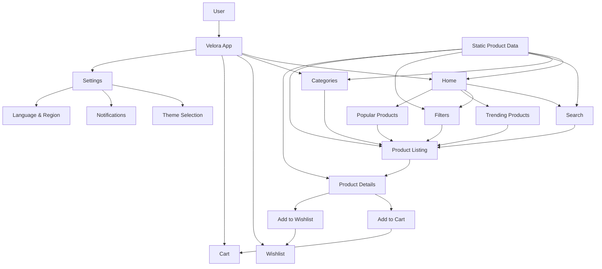
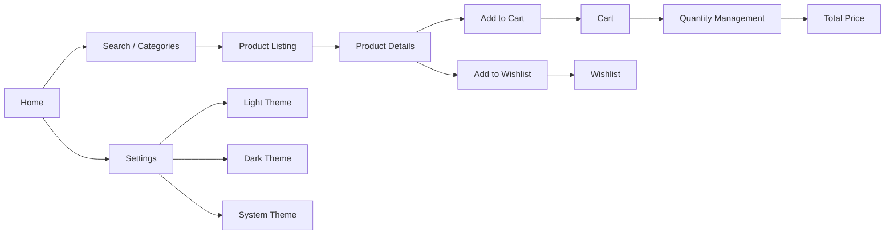
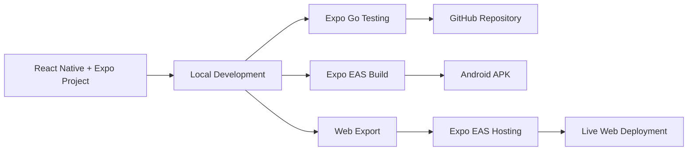

# 🛍️ Velora — Mini E-commerce App

> A clean, modern and responsive mini e-commerce application built with React Native + Expo for the Pixelwind technical assessment.

<p align="center">
  <strong>Discover products. Explore categories. Add to cart. Customize your experience.</strong>
</p>

---

## 🚀 Live Demo

🌐 **Web Deployment:**  
https://velora-e.expo.app/

📱 **Android APK / EAS Build:**  
https://expo.dev/accounts/saurav9534/projects/ecommerce-app/builds/cd9034c5-71ef-4c49-be8a-8b8d34982c51

💻 **GitHub Repository:**  
https://github.com/Saurav6200907210/Pixelwind-assignment

---

## 📌 Project Overview

Velora is a mini e-commerce application designed to provide a smooth and modern shopping experience across mobile and web.

The application is built using React Native and Expo and uses dummy/static product data as required by the assessment.

No backend or external API integration is used.

The application focuses on:

- Clean and modern UI
- Responsive design
- Smooth navigation
- Product discovery
- Category browsing
- Product details
- Wishlist management
- Cart management
- Search and filtering
- Theme customization

---

## ✨ Features

### 🏠 Home

- Product discovery
- Search products
- Promotional carousel
- Shop by Category
- Trending Now
- Popular Products
- Customer Feedback
- Why Shop With Us section

### 🔎 Search & Filters

- Search products by name
- Category filtering
- Price range filtering
- Rating filtering
- Combined search and filter functionality
- Responsive product results

### 🗂️ Categories

- Multiple product categories
- Category-based product filtering
- Category browsing
- Smooth category navigation

### 📦 Product Details

- Product image
- Product name
- Product price
- Product description
- Product rating
- Product category
- Add to cart
- Add to wishlist

### 🛒 Cart

- Add products to cart
- Remove products from cart
- Increase product quantity
- Decrease product quantity
- Automatic total price calculation
- Persistent cart state during navigation

### ❤️ Wishlist

- Add products to wishlist
- Remove products from wishlist
- View saved products
- Wishlist state synchronized with product cards and product details

### ⚙️ Settings

- Light theme
- Dark theme
- System theme
- Notification preference
- Language & Region
- Responsive settings UI

---

## 🧰 Tech Stack

| Technology | Usage |
|---|---|
| React Native | Mobile application UI |
| Expo | React Native development platform |
| JavaScript / TypeScript | Application development |
| Expo Router / Navigation | Screen navigation |
| Static Data | Product and category data |
| EAS Build | Android APK generation |
| EAS Hosting | Web deployment |

---

## 🏗️ Application Architecture



---

## 🔄 User Flow



---

## 🚀 Deployment & Build Flow



---

## 📱 Main Screens

The application includes:

- Home
- Search
- Categories
- Product Listing
- Product Details
- Wishlist
- Cart
- Settings

The interface is designed to provide a smooth and responsive experience across different screen sizes.

---

## 📊 Assessment Requirements

| Assessment Requirement | Status |
|---|---|
| React Native + Expo Go | ✅ Completed |
| Home | ✅ Completed |
| Product Listing | ✅ Completed |
| Search | ✅ Completed |
| Product Details | ✅ Completed |
| Product Image | ✅ Completed |
| Product Price | ✅ Completed |
| Product Description | ✅ Completed |
| Product Ratings | ✅ Completed |
| Categories | ✅ Completed |
| Add Products to Cart | ✅ Completed |
| Remove Products from Cart | ✅ Completed |
| Quantity Management | ✅ Completed |
| Total Price Calculation | ✅ Completed |
| Settings | ✅ Completed |
| Custom Theme Selection | ✅ Completed |
| Navigation | ✅ Completed |
| Responsive UI | ✅ Completed |
| Dummy / Static Data | ✅ Completed |
| Android APK | ✅ Built |
| Web Deployment | ✅ Live |

---

## 🛠️ Run Locally

### 1. Clone the repository

```bash
git clone https://github.com/Saurav6200907210/Pixelwind-assignment.git
cd Pixelwind-assignment
```

### 2. Install dependencies

```bash
npm install
```

### 3. Start the Expo development server

```bash
npx expo start
```

### 4. Run with Expo Go

Scan the QR code displayed in the terminal using the Expo Go application.

### Run on Web

```bash
npx expo start --web
```

---

## 📱 Android APK

The Android application was built using **Expo Application Services (EAS)**.

### Build Information

- **Platform:** Android
- **Build Profile:** Preview
- **Build Status:** Finished
- **Build Service:** Expo EAS
- **Application:** Velora

### EAS Build

https://expo.dev/accounts/saurav9534/projects/ecommerce-app/builds/cd9034c5-71ef-4c49-be8a-8b8d34982c51

The generated APK can be installed on a compatible Android device for testing.

---

## 🌐 Deployment

The web version of Velora is deployed using **Expo EAS Hosting**.

### Live Application

**https://velora-e.expo.app/**

The deployed version can be opened directly in a browser to review the application UI and functionality.

---

## 🔐 Data & Backend

This assessment version intentionally uses dummy/static data.

- No backend server
- No database
- No external product API
- No authentication service
- No payment integration

This follows the assessment requirement of using dummy/static data only.

---

## 📁 Project Structure

```text
Pixelwind-assignment/
│
├── app/
├── assets/
├── components/
├── constants/
├── context/
├── data/
├── utils/
│
├── app.json
├── eas.json
├── package.json
├── package-lock.json
├── README.md
└── ...
```

---

## 🔗 Important Links

### 💻 GitHub Repository

https://github.com/Saurav6200907210/Pixelwind-assignment

### 🌐 Live Deployment

https://velora-e.expo.app/

### 📱 Android EAS Build

https://expo.dev/accounts/saurav9534/projects/ecommerce-app/builds/cd9034c5-71ef-4c49-be8a-8b8d34982c51

---

## 📤 Assessment Submission

### GitHub Repository

Complete source code and project documentation:

https://github.com/Saurav6200907210/Pixelwind-assignment

### Android APK

Android APK generated using Expo EAS Build:

https://expo.dev/accounts/saurav9534/projects/ecommerce-app/builds/cd9034c5-71ef-4c49-be8a-8b8d34982c51

### Deployment

Live web application:

https://velora-e.expo.app/

### Deployment Details

- **Framework:** React Native + Expo
- **Web Hosting:** Expo EAS Hosting
- **Android Build:** Expo Application Services (EAS)
- **Data Source:** Dummy/Static Data
- **Backend:** Not used
- **External API:** Not used

---

## 👨‍💻 Developer

**Saurav Kumar**

React Native • Expo • Full-Stack Development • DevOps

---

## 📄 License

This project was created for a technical assessment and portfolio demonstration.
